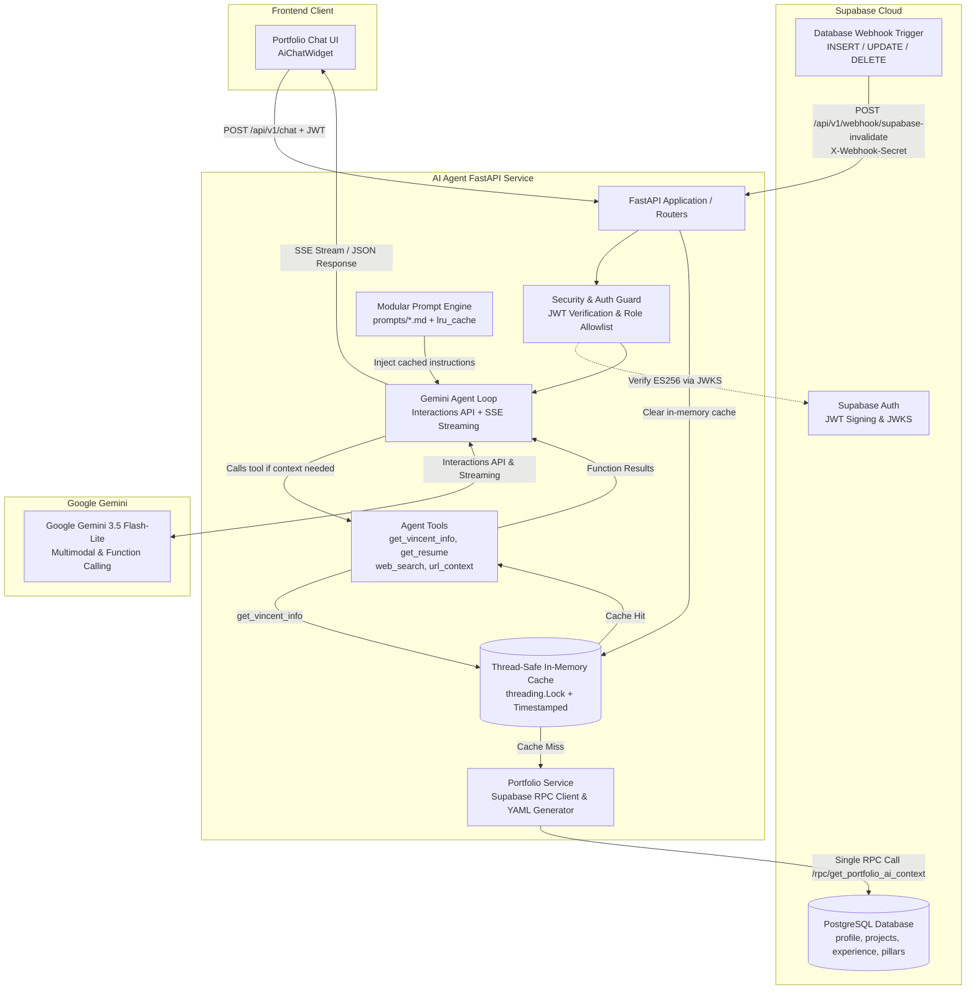

# Vincent Yuan AI Agent Microservice

A production-grade, secure **FastAPI** backend powering Vincent Yuan's portfolio AI companion and multimodal document analyzer. Built with the **Google Gemini Interactions API**, **Supabase JWT Authentication**, **Thread-Safe In-Memory Caching**, and **Automated Supabase Database Webhook Cache Invalidation**.

---

## 🏛️ System Architecture



---

## 🌟 Key Features

### 1. Live Portfolio Knowledge Base & Database-Level Filtering
- **High-Performance PostgreSQL RPC (`get_portfolio_ai_context`)**: Retrieves Vincent's complete portfolio profile (`profile`, `projects`, `experience`, `philosophy_pillars`) in a single round-trip HTTP POST call to `/rest/v1/rpc/get_portfolio_ai_context`.
- **Database-Level Field Pruning (Zero Leakage & Byte Efficiency)**:
  - **Excludes Unneeded Metadata**: Strips internal primary keys (`id`), timestamps (`created_at`, `updated_at`), and sorting indexes before payload transmission.
  - **Excludes Heavy Binary / Image URLs**: Omit project cover screenshots and employer logos that waste LLM tokens.
  - **JSONB Key Stripping**: Uses Postgres JSONB operators (`h - 'images' - 'displayOrder' - 'id'`) to prune heavy image galleries from `hobbies` in-engine.
- **Dense YAML Serialization**: Directly converts PostgreSQL's aggregated JSON into clean YAML with `sort_keys=False, allow_unicode=True`, maximizing LLM context comprehension while reducing token count by ~20% compared to Markdown.
- **Thread-Safe In-Memory Cache**: Serves responses via double-checked `threading.Lock()` caching, ensuring instantaneous context provision for subsequent chat turns with sub-millisecond retrieval.

### 2. Automated Supabase Database Webhooks
- **Zero Frontend Overhead**: Cache invalidation is decoupled from frontend code and triggered automatically by Supabase Database Webhooks on `INSERT`, `UPDATE`, or `DELETE` events.
- **Fail-Closed Security**: Endpoint (`POST /api/v1/webhook/supabase-invalidate`) enforces constant-time `hmac.compare_digest` validation against the configured `SUPABASE_WEBHOOK_SECRET` via `X-Webhook-Secret` or `Authorization: Bearer <secret>`.
- **Instant Invalidation**: Once invalidation occurs, the next question automatically queries Supabase for the fresh database state and repopulates the cache.

### 3. Agent Tool System (`app/tools.py`)
- `get_vincent_info`: Fetches authoritative, real-time context about Vincent from the portfolio database (cached in memory).
- `get_resume`: Extracts and serves Vincent's official resume document text.
- `web_search`: Live search tool providing real-world facts, current news, and documentation outside of the portfolio database.
- `url_context`: Built-in Gemini tool enabling direct analysis and inspection of external web pages and GitHub repositories (e.g., `https://github.com/VincentYuann/portfolio`).
- `execute_supabase_sql`: *(Admin Only)* Generates and executes validated, safe PostgreSQL statements directly against Vincent's Supabase database to add, update, or edit portfolio tables.

### 4. Modular Prompt Architecture & Anti-Slop Style Guide (`prompts/`)
- **Decoupled Prompt Management**: System prompts are cleanly extracted out of Python code into native Markdown files:
  - `prompts/guest_instruction.md`: Visitor companion persona, live knowledge base grounding, and web search instructions.
  - `prompts/admin_instruction.md`: Admin copilot persona, additive upsert policies, dollar-quoting PostgreSQL standards, and entity classification.
  - `prompts/writing_style_guide.md`: Mandatory editorial anti-slop style guide.
- **In-Memory Caching (`@lru_cache`)**: Prompts are loaded from disk once on demand and held in RAM, eliminating filesystem I/O overhead during chat interactions.
- **Strict Anti-Slop Writing Mandate**:
  - **Tone**: Prohibits editorializing (*"it's important to note"*), promotional hype (*"stunning"*, *"breathtaking"*, *"rich heritage"*), and conversational pleasantries/sign-offs (*"I hope this helps!"*, *"Let me know if..."*).
  - **Structure**: Eliminates forced summary conclusions (*"In summary"*, *"Overall"*, *"In conclusion"*) and templated boilerplate.
  - **Language**: Eliminates overused connectors and flagged AI vocabulary (*delve*, *underscore*, *boast*, *showcase*, *testament to*, *encompassing*, *valuable insight*, *key turning point*).

### 5. Admin Database Copilot & Semantic SQL Generation
- **Document & Text Understanding**: Ingests uploaded resumes (PDF), project screenshots/images, and plain-text instructions to synthesize database operations.
- **Strict Resume Upsert Guardrails (Non-Destructive & Additive)**:
  - When asked to "upsert", "update", or "sync" with a resume or document, the agent ONLY inserts new items or updates existing matching items.
  - **Never deletes unmentioned records**: Roles omitted from a tailored resume (e.g., service, retail, or earlier positions) are preserved intact unless the admin explicitly issues a direct command containing the word "delete" or "remove".
- **Semantic Entity Classification & Anti-Hallucination**:
  - Employers, workplaces, and commercial companies are routed to the `experience` table.
  - Software applications, repositories, and tools are routed to the `projects` table.
  - Strictly prevents fabricating fictional tech stacks, architectures, or engineering pipelines for non-technical or real-world workplaces.
- **1-to-1 Field Preservation**: Any field explicitly specified by the admin is matched 1-to-1 verbatim without unauthorized rewriting.
- **Intelligent Semantic Inference**: For omitted fields, the agent infers appropriate, high-quality values matching Vincent's portfolio aesthetic:
  - *Projects*: Thematic Japanese kanji (e.g. `創`, `智`, `基`, `迅`, `墨`), `text[]` arrays (`ARRAY[...]::text[]`), bullet points, and active/completed status labels.
  - *Experience*: UUIDs via `gen_random_uuid()`, kanji, uppercase 2-5 letter subtitle codes (`AI`, `CRAFT`, `SYS`), and `jsonb` bullets/tags (`'["..."]'::jsonb`).
- **PostgreSQL Array & JSONB Type Standards**: Eliminates bare bracket `[...]` syntax errors by strictly enforcing `ARRAY[...]::text[]` for `projects` and `'[...]':jsonb` for `experience`.
- **Zero Management Token Threat**: Operates with **zero personal access tokens (`sbp_...`)**. Queries are executed via the native PostgreSQL RPC function `public.execute_admin_sql` through the standard Supabase Data API authenticated by the admin's Supabase Auth JWT.
- **Instant Frontend Reflection**: Successful mutations invalidate the backend RAM cache and fire Supabase Realtime CDC events (`postgres_changes` on `schema: public`), updating the portfolio React UI in real-time.

### 6. Gemini Interactions API & Real-Time SSE Streaming
- **Model**: Powered by **`gemini-3.5-flash-lite`** with configurable thinking level for high-throughput, low-latency conversational reasoning.
- **Real-Time SSE Streaming**: Supports Server-Sent Events (`stream=true`) streaming individual token deltas, tool invocation statuses, and completion events.
- **Stateful Multi-Turn Conversations**: Chains context using `previous_interaction_id` to maintain ongoing conversations without resending chat histories.

### 7. Role-Based Access Control & Strict 3-Layer Security
- **Layer 1: Prompt & Tool Isolation**: Non-admin visitors receive `GUEST_SYSTEM_INSTRUCTION` with zero exposure of database schemas, and `execute_supabase_sql` is completely omitted from Gemini's tool schema.
- **Layer 2: Server-Side Tool Whitelist & Safety Guardrails**: `app/agent.py` validates that invoked tools match the user's authorized toolset. `app/db_service.py` blocks dangerous DDL (`DROP`, `TRUNCATE`, `ALTER`), system schema access, and unbounded deletes.
- **Layer 3: Database-Level RLS Enforcement**: Inside PostgreSQL, `public.execute_admin_sql` checks `auth.jwt() ->> 'email' = 'vincentyuan1020@gmail.com'`. Unauthorized users are rejected at the database level.
- **Stateless Supabase Authentication**: Validates tokens using either asymmetric JWKS (ES256/RS256) or symmetric secret (HS256).
- **CORS Protection**: Locked to explicit portfolio origin domains (`settings.ALLOWED_ORIGINS`).

---

## 📂 Project Structure

```text
AI Agent/
├── .env.example                  # Environment variables template
├── .gitignore                    # Secrets & cache ignore rules
├── Dockerfile                    # Multi-stage production container build
├── pyproject.toml                # Project metadata & pytest configuration
├── uv.lock                       # Deterministic dependency lockfile
├── README.md                     # Architecture & operations documentation
├── prompts/                      # Modular, cached prompt templates
│   ├── admin_instruction.md      # Admin copilot persona & database upsert rules
│   ├── guest_instruction.md      # Guest visitor companion persona & guidelines
│   ├── writing_style_guide.md    # Editorial & anti-slop writing guidelines
│   └── supabase_sql_tool_description.md # Supabase table schemas & SQL tool instructions
├── assets/                       # Static assets & database migration scripts
│   ├── Vincent_Yuan_Resume.pdf   # Resume source document
│   ├── get_portfolio_ai_context.sql # Read aggregation RPC migration
│   └── execute_admin_sql.sql     # Safe admin database execution RPC
├── tests/                        # Automated test suite
│   ├── __init__.py
│   ├── test_portfolio_cache.py   # Caching, tools, webhook, and auth tests
│   └── test_sql_admin.py         # SQL safety, role isolation & RPC execution tests
└── app/
    ├── __init__.py
    ├── config.py                 # Settings, Pydantic models & cached prompt loader
    ├── security.py               # Supabase JWT decoding, JWKS & RBAC guards
    ├── db_service.py             # Safe SQL validation & Supabase PostgREST RPC dispatcher
    ├── portfolio_service.py      # Thread-safe server cache & Supabase RPC client
    ├── files.py                  # Magic-byte security & Gemini file streaming
    ├── tools.py                  # Agent tool definitions, schemas & cached asset loaders
    ├── agent.py                  # Gemini Interactions API loop, tool whitelist & SSE streaming
    └── main.py                   # FastAPI app, chat endpoint & webhook handlers
```

---

## 🚀 Getting Started

### Prerequisites
* Python `>= 3.13`
* [`uv`](https://github.com/astral-sh/uv) (fast package and environment manager)

### 1. Installation
```bash
git clone https://github.com/VincentYuann/AI-Agent.git
cd AI-Agent
uv sync
```

### 2. Environment Configuration
Copy the template and configure your secrets:
```bash
cp .env.example .env
```

Key environment variables in `.env`:
```env
# Google Gemini API Key
GEMINI_API_KEY=your_gemini_api_key_here

# Supabase Auth & JWT
SUPABASE_URL=https://<your-project-id>.supabase.co
SUPABASE_JWT_SECRET=your_supabase_jwt_secret_here
SUPABASE_ANON_KEY=your_supabase_anon_key_here

# Webhook Secret for Database Cache Invalidation
SUPABASE_WEBHOOK_SECRET=whsec_your_custom_secret_here

# Admin Allowlist
ADMIN_EMAILS=vincentyuan1020@gmail.com
ADMIN_USERNAMES=vincentyuann
ADMIN_ROLES=admin,service_role

# Environment & Server
ENVIRONMENT=development
```

### 3. Database Setup: Create Supabase SQL RPC Function
Execute the SQL migration script located in [`assets/get_portfolio_ai_context.sql`](assets/get_portfolio_ai_context.sql) inside your **Supabase Dashboard -> SQL Editor**:
- Navigates to **SQL Editor** -> **New Query**.
- Paste the contents of `assets/get_portfolio_ai_context.sql` and click **Run**.
- This creates `public.get_portfolio_ai_context()` which aggregates and filters profile data directly inside PostgreSQL.

### 4. Run the Development Server
```bash
uv run uvicorn app.main:app --reload
```

- API Base URL: `http://127.0.0.1:8000`
- Interactive OpenAPI Docs (Swagger UI): `http://127.0.0.1:8000/docs`

---

## 🧪 Testing Suite

Run the full automated test suite using `uv`:

```bash
uv run pytest
```

Tests cover:
* **RPC Context Ingestion**: Tests that `fetch_from_supabase_async` invokes `/rpc/get_portfolio_ai_context` and produces valid YAML.
* **Tool Registrations**: Validates that all users receive knowledge base tools and admin-only tools are appropriately controlled.
* **Cache Lifecycle**: Validates cache hit consistency, timestamp preservation, and manual invalidation.
* **Supabase Webhook Security**: Tests 401 unauthorized rejections on missing/wrong secrets, and 200 success on valid header/bearer tokens.
* **Admin Telemetry Endpoint**: Ensures guest access to `GET /api/v1/admin/cache/status` is blocked (`403 Forbidden`) and accessible only to admins (`200 OK`).

---

## 📡 API Endpoints

### 1. Health Check
`GET /`
```json
{
  "status": "healthy",
  "service": "Vincent Yuan AI Agent Backend",
  "environment": "development",
  "model": "gemini-3.5-flash-lite",
  "thinking_level": "low"
}
```

### 2. Chat with Agent
`POST /api/v1/chat` (`multipart/form-data`)

| Parameter | Type | Required | Description |
| :--- | :--- | :--- | :--- |
| `message` | `string` | Yes | User prompt or question |
| `previous_interaction_id` | `string` | No | ID from previous turn for continuing stateful conversation |
| `stream` | `boolean` | No | If `true`, returns a Server-Sent Events (SSE) stream of tokens |
| `file` | `file` | No | *(Admin only)* Attached image, screenshot, PDF, or Word document |

### 3. Supabase Webhook Cache Invalidation
`POST /api/v1/webhook/supabase-invalidate`

- **Headers**: `X-Webhook-Secret: <your_secret>` or `Authorization: Bearer <your_secret>`
- **Payload**: Standard Supabase database webhook JSON payload (containing `type`, `table`, `record`).
- **Response**:
  ```json
  {
    "status": "success",
    "message": "Portfolio cache invalidated via Supabase database webhook.",
    "table": "projects",
    "event_type": "UPDATE",
    "invalidated_at": 1727289600.0,
    "was_cached": true
  }
  ```

### 4. Admin Cache Status
`GET /api/v1/admin/cache/status`

- **Headers**: `Authorization: Bearer <admin_jwt>`
- **Response**:
  ```json
  {
    "is_cached": true,
    "cached_at": 1727289600.0,
    "age_seconds": 42.5,
    "content_length_chars": 5832
  }
  ```

---

## ⚡ Supabase Database Webhook Setup

When deploying to Google Cloud Run (or using a local tunnel like ngrok/Cloudflare Tunnel):

1. Open your **Supabase Dashboard** $\rightarrow$ **Database** $\rightarrow$ **Webhooks**.
2. Click **Create a new webhook**.
3. Set the following parameters:
   - **Name**: `invalidate-portfolio-ai-cache`
   - **Table**: Select tables `profile`, `projects`, `experience`, `philosophy_pillars`.
   - **Events**: Check `Insert`, `Update`, and `Delete`.
   - **Webhook Type**: `HTTP Request`
   - **HTTP Method**: `POST`
   - **URL**: `https://<YOUR-CLOUD-RUN-URL>/api/v1/webhook/supabase-invalidate`
   - **HTTP Headers**:
     - `X-Webhook-Secret`: `<SUPABASE_WEBHOOK_SECRET>`
4. Save the webhook. Whenever portfolio content is modified, the cache will automatically invalidate.

---

## 🐳 Docker Deployment

```bash
docker build -t vincent-ai-agent .
docker run -p 8000:8000 --env-file .env vincent-ai-agent
```

---

## 🔒 Security Summary

* **Secrets Management**: Loaded exclusively through `pydantic-settings` using `SecretStr` to protect credentials against accidental logging.
* **JWT Integrity**: Cryptographically verifies Supabase Access Tokens with audience enforcement (`authenticated`).
* **SSRF Guard**: Strict JWKS resolution pinned to configured project URL.
* **Upload Defense**: 8KB magic-byte verification with ZIP internal structure validation against spoofed file extensions.
* **Zero Disk Storage**: In-memory `io.BytesIO` streams eliminate lingering temporary files and filesystem traversal vectors.
