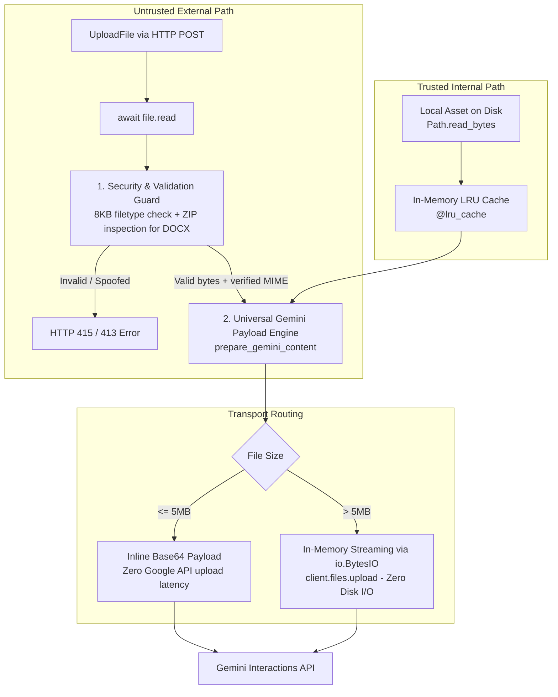

# Vincent Yuan AI Agent Backend

A production-grade, secure **FastAPI** backend powering an AI portfolio assistant and multimodal document analyzer using the **Google Gemini Interactions API**, **Supabase JWT Authentication**, and **Role-Based Access Control (RBAC)**.

---

## 🏛️ Architecture Evolution: Initial vs. Current Refactored Design

### The Initial Design & Vulnerabilities (First Conversation Analysis)
In our initial implementation, file handling and validation suffered from critical security loopholes, code duplication, and unnecessary disk overhead:

1. **Extension-Based Word Bypass (`.docx` / `.doc`)**:
   ```python
   # INSECURE LEGACY CODE:
   ext = Path(file.filename or "").suffix.lower()
   if ext == ".docx":
       detected_mime = "application/vnd.openxmlformats-officedocument.wordprocessingml.document"
   ```
   Because `filetype.guess()` struggled with small header buffers, this fallback blindly trusted the user-supplied file extension. An attacker could rename `malware.exe` or an executable script to `exploit.docx` and bypass all magic-byte verification.
2. **Untrusted Client Header Fallback**:
   If magic-byte sniffing returned `None`, the system fell back to `file.content_type`. Since HTTP `Content-Type` headers are arbitrarily set by the client, spoofed headers completely defeated the purpose of magic-byte verification.
3. **Insufficient Header Inspection Buffer**:
   Inspecting only 512–2048 bytes was too small to reliably detect ZIP metadata (`[Content_Types].xml`, `word/document.xml`) and OLE2 compound document structures, causing false negatives.
4. **Unnecessary Disk I/O & Temp Files**:
   Files $\ge$ 5MB were written to disk via `tempfile.gettempdir()`, uploaded to the Gemini Files API, and deleted via `finally: temp_file.unlink()`. This introduced unnecessary disk writes, race conditions, and filesystem cleanup dependencies.
5. **Code Duplication & Scattered Responsibilities**:
   Local asset loaders (such as `_load_champ_tier_list_base64` in `tools.py`) manually read bytes, converted them to base64, and hand-crafted payload structures, duplicating logic already implemented in `files.py`.
6. **Polymorphic Complexity & `isinstance` Branching**:
   Early refactor attempts accepted `Union[bytes, Path]`, forcing runtime `isinstance` type-sniffing, awkward variable state tracking (`file_bytes = None`), and disconnected size verifications.

---

### The Modern Refactored Architecture (Current Design)

The backend now enforces strict **Separation of Concerns** with a **Universal Raw Byte Pipeline**:



#### Key Architecture Principles:
* **Universal Data Model (`bytes`)**: Everything standardizes on raw `file_bytes: bytes`. No polymorphic type checks or `isinstance` branches.
* **Direct In-Memory Streaming**: Google GenAI SDK's `client.files.upload()` natively accepts `io.BytesIO`. Files are streamed directly to the Gemini Files API from RAM without touching the server's disk or requiring temp directories.
* **Unified Size Engine**: A single pipeline verifies against the 50MB ceiling (`MAX_FILE_SIZE_BYTES`, raising `HTTP 413`) and routes payloads $\le$ 5MB (`INLINE_SIZE_LIMIT_BYTES`) to Base64 vs. $>$ 5MB to Google Files API.
* **Strict Separation of Concerns**:
  * **Security Guard (`validate_upload_magic_bytes`)**: Exclusively defends untrusted HTTP uploads using 8KB magic-byte analysis via `filetype` plus deep ZIP inspection for Office packages.
  * **Payload Adapter (`prepare_gemini_content`)**: Pure transport formatting used universally by both uploads and local assets.
* **Zero Boilerplate in Tools**: Local assets (`tools.py`) simply read their bytes and delegate directly to `prepare_gemini_content()`, caching the final Gemini payload in memory with `@lru_cache`.

---

## 🌟 Key Features

### 1. Modern FastAPI Service
* **Decoupled Architecture**: Modular REST API with full OpenAPI / Swagger UI documentation (`/docs`).
* **Modular Codebase**:
  * `app/config.py`: Centralized type-safe configuration via `pydantic-settings`.
  * `app/security.py`: Stateless Supabase JWT verification and dynamic admin role checking.
  * `app/files.py`: Universal in-memory bytes pipeline, magic-byte inspection, and hybrid file routing.
  * `app/tools.py`: In-memory cached portfolio tools (`get_resume`, `get_champ_tier_list`).
  * `app/agent.py`: Google GenAI Interactions API execution engine with multi-turn conversation and function-calling loop.
  * `app/main.py`: FastAPI application factory, health check, and endpoints.

### 2. Role-Based Security & Supabase Auth
* **Public / Guest Access**: Anyone can chat with the assistant via text to ask about Vincent's experience, skills, education, and portfolio.
* **Admin-Only Features**: File uploads (images, screenshots, PDFs, Word docs) and elevated tool access are strictly restricted to authenticated Supabase Administrators (identified via JWT claims or configured admin emails).
* **Swagger UI Integration**: Uses `HTTPBearer(auto_error=False)` allowing guests to test the API directly without 401 errors, while admins can authenticate using the green **Authorize** button in Swagger UI.

### 3. High-Throughput Model & Rate-Limit Resilience
* Powered by **`gemini-3.6-flash`**, providing **1,500 free requests per day (RPD)** and **15 requests per minute (RPM)**.
* Graceful HTTP `429 Too Many Requests` handling prevents server crashes or unhandled tracebacks.

---

## 📂 Project Structure

```text
AI Agent/
├── .env.example              # Environment variables template
├── .gitignore                # Git ignore rules (protects secrets & virtualenvs)
├── Dockerfile                # Multi-stage container build with Python 3.13 & uv
├── pyproject.toml            # Project dependencies & metadata
├── uv.lock                   # Deterministic dependency lockfile
├── assets/                   # Portfolio assets (Resume PDF, tier list image)
│   ├── Vincent_Yuan_Resume.pdf
│   └── champ_tier_list.webp
└── app/
    ├── __init__.py
    ├── config.py             # Settings & Gemini Client initialization
    ├── security.py           # Supabase JWT decoding & dynamic Admin verification
    ├── files.py              # Universal bytes pipeline & magic-byte validation
    ├── tools.py              # Cached local tools & tool schema definitions
    ├── agent.py              # Gemini Interactions API loop & tool runner
    └── main.py               # FastAPI app & POST /api/v1/chat endpoint
```

---

## 🚀 Getting Started

### Prerequisites
* Python `>= 3.13`
* [`uv`](https://github.com/astral-sh/uv) (recommended fast package manager)

### 1. Clone & Install Dependencies
```bash
git clone <your-repo-url>
cd "AI Agent"
uv sync
```

### 2. Configure Environment Variables
Copy `.env.example` to `.env` and fill in your keys:
```bash
cp .env.example .env
```

Edit `.env`:
```env
GEMINI_API_KEY=your_gemini_api_key_here
SUPABASE_JWT_SECRET=your_supabase_jwt_secret_here
ADMIN_EMAILS=vincentyuan1020@gmail.com
ADMIN_ROLES=admin,service_role
ENVIRONMENT=development
```

### 3. Run the Development Server
```bash
uv run uvicorn app.main:app --reload
```

Server will be running at: `http://127.0.0.1:8000`
Interactive API Docs (Swagger UI): `http://127.0.0.1:8000/docs`

---

## 🧪 API Endpoints

### 1. Health Check
`GET /`
```json
{
  "status": "healthy",
  "service": "Vincent Yuan AI Agent Backend",
  "environment": "development",
  "model": "gemini-3.6-flash"
}
```

### 2. Chat with Agent
`POST /api/v1/chat` (Content-Type: `multipart/form-data`)

**Form Fields:**
* `message` *(required, string)*: The prompt or question.
* `previous_interaction_id` *(optional, string)*: Interaction ID for stateful multi-turn conversations.
* `file` *(optional, file upload, Admin only)*: Attached image, screenshot, PDF, or DOCX.

**Responses:**
* `200 OK`: Successful response containing `user_type`, `interaction_id`, and `response`.
* `403 Forbidden`: Returned when a guest or non-admin attempts to upload a file.
* `415 Unsupported Media Type`: Returned if an uploaded file fails magic-byte validation or is spoofed.
* `429 Too Many Requests`: Returned when Google API quota limits are reached.

---

## 🐳 Docker Deployment

Build and run using Docker:

```bash
docker build -t vincent-ai-agent .
docker run -p 8000:8000 --env-file .env vincent-ai-agent
```

---

## 🔒 Security Summary
* Secrets are loaded via `pydantic-settings` using `SecretStr` to prevent accidental logging.
* JWT validation strictly enforces the HMAC-SHA256 signature algorithm against `SUPABASE_JWT_SECRET`.
* Strict 8KB magic-byte verification with ZIP structure validation prevents MIME-type and extension spoofing.
* In-memory `io.BytesIO` streams eliminate lingering temporary files and disk traversal attacks.
* No sensitive API keys or credentials are committed to version control.
